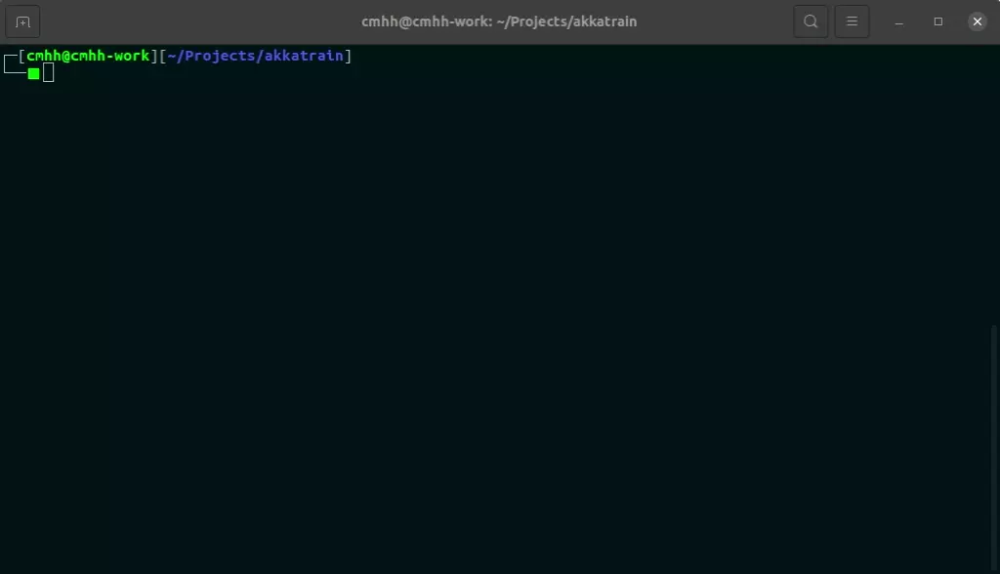

# Online Learning with [Akka](https://akka.io/)

This repository contains a simple collection of actors which we use to train a convolutional neural network using with images from the [MNIST database](http://yann.lecun.com/exdb/mnist/).  The system consists of three actors:

* `Producer` is responsible for sending images to `Consumer`
* `Consumer` trains a neural network after receiving messages
* `Coordinator` is used to facilitate communcation between `Consumer` and `Producer`, and the outside world.

The classifier is a neural net, build via [Deeplearning4j](https://deeplearning4j.org/).

To build the application, run:

```bash
sbt assembly
```

This will produce `target/scala-2.13/akkatrain.jar`, which can be used like any other jar.  To start a demo application, run:

```bash
java -cp target/scala-2.13/akkatrain.jar org.cmhh.Main
```

